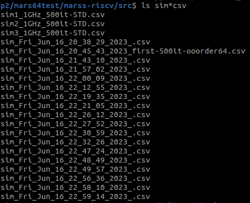

# CPS703 - Arquitetura de Computadores 2
Arquivos de Resultado experimental do trabalho prático da disciplina de mestrado do PESC/COPPE - UFRJ.

**Aluna: Juliana Fernandes Dal Piaz**

## Objetivo

Analisar as mudanças de performance causadas por alterações nas definições de hardware da arquitetura RISC-V.

## Ferramentas
- [MARS RISC-V](https://github.com/bucaps/marss-riscv)
- Debian Based Linux (ex.: Ubuntu)
- [Coremark](https://www.eembc.org/coremark/)
- Python
- Jupyter

## Simulação
Começei lendo [esse](https://marss-riscv-docs.readthedocs.io/en/latest/sections/running-full-system.html#) tutorial que tem o passo a passo de instalação do simulador, configuração das imagens RISC-V, como rodar o simulador com o arquivo de configuração da imagem e também como instalar, configurar e rodar o becnhmark supracitado.

### Tentativas de Instalação das ferramentas 
Tentei instalar numa máquina RedHat num primeiro momento, o que foi infrutífero, pois as bibliotecas padrão necessárias não existiam com o mesmo nome na distribuição como, talvez, existisse incompatibilidade.

Então na segunda vez que instalei o simulador o fiz numa máquina Debian (Ubuntu), o que funcionou perfeitamente.

Posteriormente também testei a instalação num Ubuntu instalado no WSL do Windows 10, que também funcionou perfeitamente.

Importante notar que acabei testando as versões 32 e 64 da máquina RISC-V. 

Como o simulador foi compilado com a configuração CONFIG_XLEN = 32 no tutorial e este se mostrou problemático num primeiro momento, fiz uma nova pasta para clonar novamente o repositório do MARS e compilei com o valor default: CONFIG_XLEN =64
A máquina final a qual rodei os experimentos foi a 64.


### Subindo a Simulação a partir das imagens

Sobre esse tópico, ao longo do tutorial não é mencionado sobre a necessidade de copiar a pasta com o arquivo de imagem para a pasta *./configs/*, pois quando executei o comando abaixo de dentro da pasta *src* do MARS

```bash
./marss-riscv -rw -ctrlc -sim-mem-model base ../configs/<ARQUIVO_CONFIG>
```
Este retornou um erro indicando não encontrar a imagem necessária. Portanto é necessário copiar os arquivos derivados do arquivo baixado *marss-riscv-images.tar.gz* 

>A Imagem escolhida por mim para ser a padrão (STD) a ser comparada com as versões levemente alteradas foi a padrão que veio com o repositório: 
**riscv64_outoforder_soc.cfg** 

As outras versões dos arquivos de configuração de chamam, respectivamente:
1. riscv64_outoforder_soc.cfg >> STD
1. riscv64_outoforder_tweak-1.cfg >> TK1
1. riscv64_outoforder_tweak-2.cfg >> TK2
1. riscv64_outoforder_tweak-3.cfg >> TK3
1. riscv64_outoforder_tweak-4.cfg >> TK4
1. riscv64_outoforder_tweak-5.cfg >> TK5

>OBS.: As tentativas falhas estão no arquivo TK3.

Após abrir o prompt, a primeira coisa a ser feita é definir a data do sistema (VM Guest Machine). E sempre que era necessário subir novamente a simulação, é necessário esse passo.
```bash
date --set="16 Jun 2023 23:05:00"
```

## Definindo as Diferenças entre arquivos de Configuração

Tweak 1:
Clock em 5GHz
- core['core']['cpu_freq_mhz'] = 5000

tweak 2:

- core['oocore']['iq_size'] = 32
- core['oocore']['iq_issue_ports'] = 6

Tweak -- Tentativa:
 
- core['oocore']['rob_size'] = 128
- core['oocore']['rob_commit_ports'] = 8

Tweak -- Tentativa Cumulativa:

- core['oocore']['iq_size'] = 32
- core['oocore']['iq_issue_ports'] = 6
- core['oocore']['rob_size'] = 128
- core['oocore']['rob_commit_ports'] = 8

O Erro gerado pelas duas tentativas está representado abaixo.

```
localhost ~/coremark # simstart; ./coremark.exe  0x0 0x0 0x66 500 7 1 2000 > ./run1.log; simstop;
* (marss-riscv): Switching to full-system simulation mode at pc = 0x0000002aaaaaa66e
* (marss-riscv): error: riscvsim/utils/cpu_latches.c at line 106 in insn_latch_allocate(): failed to allocate instruction latch from instruction latch pool
Aborted (core dumped)
```

Tweak 3:
- core['bpu']['btb']['size'] = 128
- core['bpu']['btb']['ways'] = 8

Tweak 4:
- core['bpu_type'] = "adaptive"
- core['bpu']['adaptative']['ght_size'] = 128
- core['bpu']['adaptative']['pht_size'] = 128


### Rodando o Coremark na Simulação
Após todas as configurações dos repositórios do *Coremark* e do *marss-riscv-utils*, o comando para executar a simulação estava em Stall permanente. Testei isso ao longo de dois dias esperando mais de **DUAS** horas antes de fechar a tentativa. Uma variação do comando defeituoso e sua correção estão abaixo.

```bash
# comando que entra em stall permanente
simstart; ./coremark.exe  0x0 0x0 0x66 0 7 1 2000 > ./run1.log; simstop;

# comando corrigido com o 4º argumento (Nº de iterações) diferente de zero:
simstart; ./coremark.exe  0x0 0x0 0x66 500 7 1 2000 > ./run1.log; simstop;
```
Rodar o benchmark dentro desse *environment* gera saídas bem estruturadas diretamente na pasta *src* do MARS.



## Avaliação de Performance
A partir dos arquivos de log e CSV que o benchmark rodando dentro da simulação gerava, foi possível comparar os desempenhos entre as levemente diferentes arquiteturas utilizando o Coremark. 

Os Gráficos gerados estão abaixo.

### Gráficos


